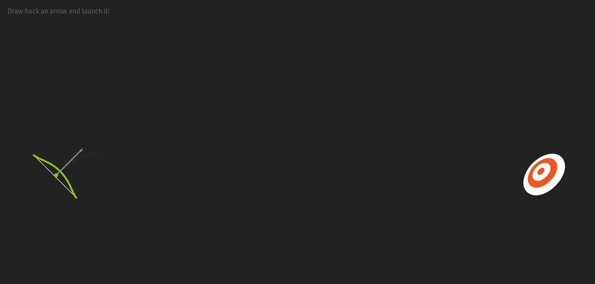

# Bullseye-Game

## Overview
 
 Basically the bow on the left is pull back and arrow is thrown at the marks. If you hit it you get a 'HIT!', If missed you get a 'MISS!' and when you hit the bulleye you get a 'BULLSEYE!'.

### The challenge

The challenge was to make the svgs more interactive with javascript. like the pulling back of the bow, arrow shooting and hitting on the marks.

### Screenshot




### Links
)
- Live Site URL: [Add live site URL here](https://your-live-site-url.com)

### Built with

- Semantic HTML5 markup
- CSS custom properties
- Flexbox
- CSS Grid
- Mobile-first workflow
- SVGS

### What I learned

I learned a lot about svgs and how useful they're 

```js
const proudOfThisFunc = () => {
  console.log('🎉')
	var path = MorphSVGPlugin.pathDataToBezier("#arc");
	TweenMax.to([newArrow], 0.5, {
		force3D: true,
		bezier: {
			type: "cubic",
			values: path,
			autoRotate: ["x", "y", "rotation"]
		},
		onUpdate: hitTest,
		onUpdateParams: ["{self}"],
		onComplete: onMiss,
		ease: Linear.easeNone
	});
	TweenMax.to("#arc", 0.3, {
		opacity: 0
	});
	//hide previous arrow
	TweenMax.set(".arrow-angle use", {
		opacity: 0
	})
        

```


## Author

- Website - [Add your name here](https://www.your-site.com)
- Twitter - [@Amani_Off](https://www.twitter.com/yourusername)

